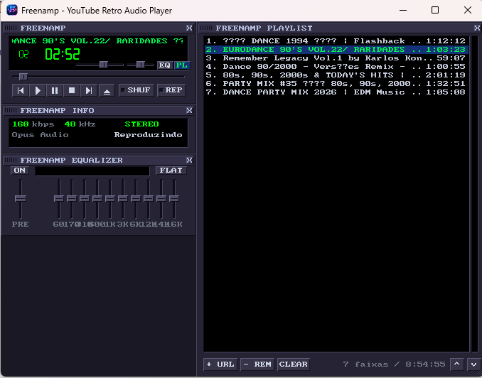

# Freenamp

> **YouTube Retro Audio Player** — A lightweight, modern C++20 desktop music player with the authentic look, feel, and modular docking mechanics of classic Winamp, powered by `libmpv` and `yt-dlp`.

[](https://github.com/guimaraf/freenamp/actions/workflows/build.yml)
[](https://github.com/guimaraf/freenamp/releases/latest)
[](LICENSE)



### 🚀 Download (v1.0.0)

| Platform | Package | Description |
| :--- | :--- | :--- |
| **Linux (x86_64)** | [freenamp-linux-x86_64.tar.gz](https://github.com/guimaraf/freenamp/releases/download/v1.0.0/freenamp-linux-x86_64.tar.gz) | 100% portable bundle with bundled libraries & `iniciar_freenamp.sh` launcher |
| **Linux (x86_64)** | [Freenamp-x86_64.AppImage](https://github.com/guimaraf/freenamp/releases/download/v1.0.0/Freenamp-x86_64.AppImage) | Standalone single-file AppImage executable |
| **Windows (x64)** | [freenamp-windows-x64.zip](https://github.com/guimaraf/freenamp/releases/download/v1.0.0/freenamp-windows-x64.zip) | Standalone portable bundle with isolated DLLs in `core/` |
| **Checksums** | [SHA256SUMS.txt](https://github.com/guimaraf/freenamp/releases/download/v1.0.0/SHA256SUMS.txt) | Cryptographic verification |

---

## English

### Overview

**Freenamp** combines the iconic retro aesthetics of classic media players with direct, high-performance streaming from YouTube. It runs entirely natively with low CPU and memory footprints, bypassing the bloat of web browsers and Electron apps.

### Key Features

- **Modular Retro Interface**:
  - **Main Unit**: Classic green LED digital clock, track number, scrolling marquee title, volume/pan faders, and playback transport controls.
  - **Info Unit**: Real-time stream technical metrics (`160 kbps`, `48.0 kHz`, `STEREO`, `Opus Audio`) and segmented LED loading progress indicators.
  - **10-Band Equalizer**: Interactive sliders with preamp gain adjustment and 10 frequency bands (60 Hz to 16 kHz).
  - **Scalable Playlist**: Freely resizable via the bottom-right drag grip (`///`), continuous drag-to-scroll, track reordering (`^`/`v`), and clean metadata display with total duration and track count.
- **Magnetic Window Docking**: Subwindows magnetically attract and snap together or to screen borders. Moving the main unit moves docked child windows together.
- **YouTube Playlists & Mixes**: Seamlessly resolves single videos, full playlists, and YouTube radio mixes up to 50 tracks.
- **Smart Token & CDN Expiration Renewal**: Automatically parses YouTube CDN expiration tokens (`expire=<timestamp>`). Expired streams are re-resolved transparently on-demand without user intervention.
- **Full Session & Geometry Persistence**: Automatically persists volume, balance, shuffle, repeat, selected track, internal window positions (`x`, `y`), playlist size (`w`, `h`), and visibility states in `cache/settings.json`.
- **Stand-Alone Portable Package**: Packaged with internal DLLs isolated in a `core/` directory and standalone native Windows executable.

### Keyboard Shortcuts

| Shortcut | Description |
| :--- | :--- |
| <kbd>Space</kbd> | Toggle Play / Pause |
| <kbd>X</kbd> | Play |
| <kbd>C</kbd> | Pause |
| <kbd>V</kbd> | Stop |
| <kbd>Z</kbd> | Previous track |
| <kbd>B</kbd> | Next track |
| <kbd>Left Arrow</kbd> | Seek backward 5 seconds |
| <kbd>Right Arrow</kbd> | Seek forward 5 seconds |
| <kbd>Up Arrow</kbd> | Volume up (+5%) |
| <kbd>Down Arrow</kbd> | Volume down (-5%) |
| <kbd>L</kbd> or <kbd>Ctrl</kbd> + <kbd>V</kbd> or <kbd>Ctrl</kbd> + <kbd>O</kbd> | Open "Add YouTube URL" modal |
| <kbd>Delete</kbd> | Remove selected track from playlist |
| <kbd>Mouse Wheel</kbd> | Scroll tracklist up / down |
| <kbd>Enter</kbd> *(in dialog)* | Add URL and close modal |
| <kbd>Esc</kbd> *(in dialog)* | Cancel and close modal |

### Usage Guide

1. **Running the Player**:
   - Double-click `freenamp.exe`.
   - Optionally, pass a YouTube video or playlist link via command line:
     ```bash
     freenamp.exe "https://www.youtube.com/watch?v=VIDEO_ID"
     ```
2. **Adding Music**:
   - Click the **`+ URL`** button on the playlist toolbar, or press <kbd>L</kbd> / <kbd>Ctrl+V</kbd>.
   - If a valid YouTube URL is already in your Windows clipboard, Freenamp automatically pastes it into the field.
   - Click **`ADICIONAR`** or press <kbd>Enter</kbd>.
3. **Managing the Playlist**:
   - **Play**: Double-click any track or select it and press <kbd>X</kbd>.
   - **Reorder**: Select a track and click **`^`** (Move Up) or **`v`** (Move Down).
   - **Delete Track**: Select a track and press <kbd>Delete</kbd> or click **`- REM`**.
   - **Clear All**: Click **`CLEAR`** to empty the playlist and purge temporary playback caches.
4. **Resizing & Arranging**:
   - Drag any window by its title bar. Windows snap magnetically to each other.
   - Resize the playlist by dragging the **`///`** grip in the bottom-right corner.
   - Window positions and playlist dimensions are preserved automatically on exit.

---

## Português do Brasil

### Visão Geral

O **Freenamp** une a estética icônica retrô dos reprodutores de mídia clássicos (como o lendário Winamp) à praticidade de reproduzir áudios diretamente do YouTube. Desenvolvido nativamente em C++20 com `libmpv` e `SDL2`, o player é ultrarrápido, consome pouca memória e elimina o peso de navegadores ou aplicações baseadas em Electron.

### Recursos Principais

- **Interface Retrô Modular**:
  - **Quadro Principal**: Relógio digital em LED verde, número da faixa, letreiro deslizante com o nome da música, sliders de volume/pan e botões clássicos de transporte.
  - **Quadro Info**: Exibição técnica das características do áudio (`160 kbps`, `48.0 kHz`, `STEREO`, `Opus Audio`) e barra segmentada de progresso em LED durante o carregamento de URLs.
  - **Equalizador de 10 Bandas**: Sliders verticais independentes de 60 Hz a 16 kHz com controle de ganho pré-amplificador (Preamp) e botão Flat.
  - **Playlist Escalonável**: Redimensionamento livre pelo canto inferior direito (`///`), rolagem fluida por arrasto na barra, reordenação de faixas (`^`/`v`) e rodapé limpo com total de faixas e duração acumulada.
- **Acoplamento Magnético (Window Docking)**: As janelas internas se atraem e se encaixam magneticamente entre si e nas bordas do aplicativo. Ao mover o painel principal, as janelas acopladas movem-se juntas.
- **Playlists e Mixes do YouTube**: Suporte completo a links de vídeos únicos, playlists convencionais e mixes automáticos gerados pelo YouTube (até 50 faixas).
- **Renovação Automática de Links Expirados**: Analisa o parâmetro criptográfico `expire=` da CDN do Google. Se o link expirar de um dia para o outro, o Freenamp renova o stream em segundo plano automaticamente ao dar Play, sem exigir recarregamentos manuais.
- **Persistência Total de Sessão e Geometria**: Salva e restaura volume, balanço, modo shuffle, repeat, faixa selecionada, posições (`x`, `y`), tamanho da playlist (`w`, `h`) e estados de visibilidade em `cache/settings.json`.
- **Distribuição Portátil Standalone**: DLLs organizadas na pasta interna `core/` e executável Windows nativo com ícone em alta definição embutido.

### Atalhos de Teclado

| Atalho | Ação |
| :--- | :--- |
| <kbd>Espaço</kbd> | Alternar Reproduzir / Pausar |
| <kbd>X</kbd> | Tocar (Play) |
| <kbd>C</kbd> | Pausar (Pause) |
| <kbd>V</kbd> | Parar (Stop) |
| <kbd>Z</kbd> | Faixa anterior |
| <kbd>B</kbd> | Próxima faixa |
| <kbd>Seta Esquerda</kbd> | Retroceder 5 segundos |
| <kbd>Seta Direita</kbd> | Avançar 5 segundos |
| <kbd>Seta Cima</kbd> | Aumentar volume (+5%) |
| <kbd>Seta Baixo</kbd> | Diminuir volume (-5%) |
| <kbd>L</kbd> ou <kbd>Ctrl</kbd> + <kbd>V</kbd> ou <kbd>Ctrl</kbd> + <kbd>O</kbd> | Abrir modal "Adicionar URL do YouTube" |
| <kbd>Delete</kbd> | Remover faixa selecionada da playlist |
| <kbd>Scroll do Mouse</kbd> | Rolar lista de músicas para cima / baixo |
| <kbd>Enter</kbd> *(no diálogo)* | Confirmar adição da URL |
| <kbd>Esc</kbd> *(no diálogo)* | Cancelar e fechar diálogo |

### Guia Rápido de Uso

1. **Iniciando o Player**:
   - Execute o arquivo `freenamp.exe`.
   - Você também pode abrir uma URL diretamente via linha de comando:
     ```bash
     freenamp.exe "https://www.youtube.com/watch?v=SEU_VIDEO"
     ```
2. **Adicionando Músicas**:
   - Clique no botão **`+ URL`** na barra inferior da playlist ou pressione <kbd>L</kbd> / <kbd>Ctrl+V</kbd>.
   - Se houver um link de vídeo ou playlist do YouTube na área de transferência do Windows, o Freenamp preenche o campo automaticamente.
   - Pressione **`ADICIONAR`** ou aperte <kbd>Enter</kbd>.
3. **Gerenciando a Lista de Reprodução**:
   - **Tocar**: Dê duplo clique em qualquer música da lista ou selecione-a e pressione <kbd>X</kbd>.
   - **Reordenar**: Selecione uma faixa e use os botões **`^`** (Subir) ou **`v`** (Descer).
   - **Remover**: Selecione uma música e pressione <kbd>Delete</kbd> no teclado ou clique no botão **`- REM`**.
   - **Limpar**: Clique em **`CLEAR`** para esvaziar a lista e purgar os caches temporários de streaming.
4. **Organização das Janelas**:
   - Arraste qualquer módulo pela sua barra de título. As janelas se alinham automaticamente por magnetismo.
   - Redimensione a playlist arrastando o canto inferior direito com as três linhas diagonais (**`///`**).
   - A posição e tamanho de todas as janelas internas são gravados automaticamente e restaurados na próxima abertura.

---

### Compilação e Uso no Linux (100% Portátil)

#### 1. Pré-requisitos de compilação (Ubuntu / Debian / Mint):
```bash
sudo apt update && sudo apt install -y build-essential cmake pkg-config libsdl2-dev libmpv-dev curl
```

#### 2. Gerar o pacote portátil standalone com 1 comando:
```bash
bash compile/scripts/build_linux_portable.sh
```
A pasta portátil estará pronta em `build/freenamp_portable_linux/`, contendo o binário `freenamp`, as bibliotecas em `core/`, o extrator em `bin/yt-dlp` e os arquivos de cache/assets.

#### 3. Execução:
```bash
cd build/freenamp_portable_linux
./iniciar_freenamp.sh
```
*(Ou dê duplo clique em `iniciar_freenamp.sh` no gerenciador de arquivos do seu ambiente Linux, ou execute `./freenamp` diretamente).*

#### 4. Empacotar em AppImage (Opcional):
```bash
bash compile/scripts/build_appimage.sh
./build/Freenamp-x86_64.AppImage
```
